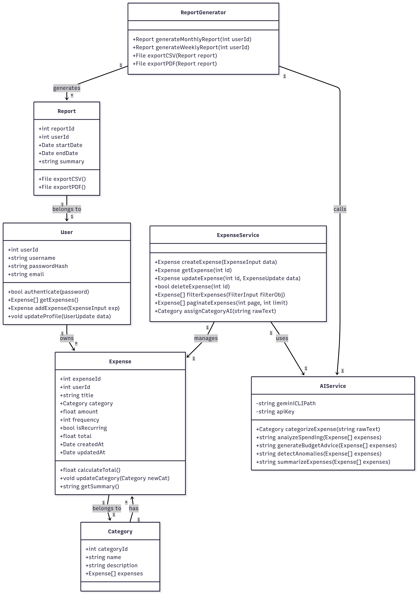

# AI-Powered Expense Tracker

## LLD Design

## Project Development Steps Overview

### **Step 1: Project Setup**
- [x] Decide project structure (monolithic: frontend + backend in same repo).
- [x] Initialise a Next.js project with TypeScript support.
- [x] Install all required dependencies (Prisma, PostgreSQL driver, zod, shadcn UI, etc.).
- [x] Set up project folder structure: `app/`, `components/`, `services/`, `prisma/`, `utils/`.
- [ ] Configure `.env` for database, Gemini CLI path, API keys, JWT secret.
- [ ] Set up TypeScript aliases and linting/formatter for clean code.

### **Step 2: Database Setup**

- [ ] Install and configure PostgreSQL (locally or via Docker).
- [ ] Define Prisma schema based on LLD: `User`, `Expense`, `Category`, `Report`.
- [ ] Define relationships in Prisma (1-to-many, 1-to-1).
- [ ] Run Prisma migrations to create tables in PostgreSQL.
- [ ] Seed initial data for categories and optional demo users.
- [ ] Test database connection with a simple Prisma client script.

### **Step 3: Authentication System**

- [ ] Create User model in Prisma with fields from LLD.
- [ ] Implement registration endpoint: validate input, hash password.
- [ ] Implement login endpoint: verify password, issue JWT token.
- [ ] Create authentication middleware to protect API routes.
- [ ] Build frontend pages for login and signup, integrating forms with backend.
- [ ] Implement logout functionality and store JWT securely (cookies or localStorage).

### **Step 4: Expense CRUD**

- [ ] Create Expense model in Prisma with fields from LLD.
- [ ] Implement backend CRUD API routes (create, read, update, delete).
- [ ] Validate input using zod schemas.
- [ ] Implement ExpenseService for business logic: calculate total, assign category.
- [ ] Build frontend Add Expense form and Expense List table.
- [ ] Enable editing and deleting of expenses from frontend.
- [ ] Add pagination, filtering, and search functionality.

### **Step 5: Category Management**

- [ ] Create Category model in Prisma and establish relation with Expense.
- [ ] Seed predefined categories (Food, Travel, Rent, Utilities, Others).
- [ ] Backend: implement assignCategoryAI in ExpenseService to call AIService.
- [ ] Frontend: show dropdown with existing categories and optional AI suggestion.
- [ ] Ensure category changes are reflected in expenses and reports.

### **Step 6: AI Integration**

- [ ] Create AIService wrapper to interact with Gemini CLI.
- [ ] Implement methods:
    * categorizeExpense
    * analyzeSpending
    * generateBudgetAdvice
    * detectAnomalies
    * summarizeExpenses
- [ ] Integrate AIService into ExpenseService and ReportGenerator where needed.
- [ ] Test AI prompts with sample expenses and verify outputs.
- [ ] Handle errors and fallback logic if AI service fails.

### **Step 7: Report Generation**

- [ ] Create Report model in Prisma with fields from LLD.
- [ ] Implement ReportGenerator service: generate weekly/monthly reports.
- [ ] Include AI-powered insights in reports: spending trends, anomalies, budget advice.
- [ ] Implement export functionality: CSV and PDF.
- [ ] Frontend: design dashboard page showing reports with charts and export buttons.
- [ ] Connect report generation to backend API routes.

### **Step 8: Frontend UI**

- [ ] Use Shadcn UI or Tailwind for consistent design system.
- [ ] Build pages: Login, Signup, Dashboard, Add Expense, Expense List, Reports.
- [ ] Connect frontend forms and components to backend API routes.
- [ ] Display AI-generated insights visually: pie charts, bar charts, text summaries, alerts.
- [ ] Ensure responsive design and accessibility.
- [ ] Implement state management (React Context or Zustand) for user sessions and data.

### **Step 9: Testing**

- [ ] Write unit tests for services: ExpenseService, AIService, ReportGenerator.
- [ ] Write integration tests for API routes using Supertest or Axios.
- [ ] Test AI responses with mock data to ensure reliability.
- [ ] Test frontend components: forms, tables, dashboards.
- [ ] Fix bugs and verify end-to-end functionality.

### **Step 10: Deployment**

- [ ] Prepare production build of Next.js app.
- [ ] Connect to managed PostgreSQL instance (Supabase, Railway, AWS RDS).
- [ ] Configure environment variables securely for production.
- [ ] Deploy app on Vercel or Render.
- [ ] Optional: Set up GitHub Actions for CI/CD automation.
- [ ] Test live app for correctness and performance.

### **Step 11: Documentation**

- [ ] Create `/docs/` folder in project root.
- [ ] Document AI prompts and expected responses.
- [ ] Include architecture diagrams, Mermaid LLD diagram, and system overview.
- [ ] Document API endpoints: request/response formats.
- [ ] Write README with project overview, features, setup instructions, and usage.
- [ ] Prepare screenshots and demo instructions for submission or presentation.